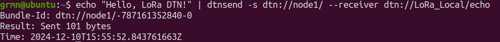
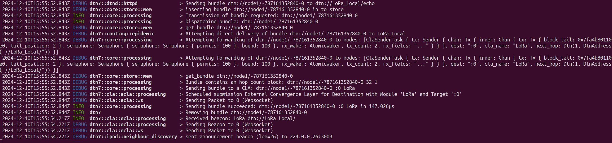
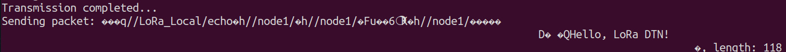
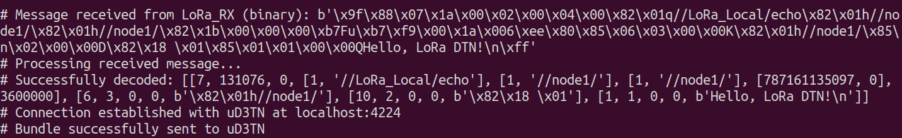
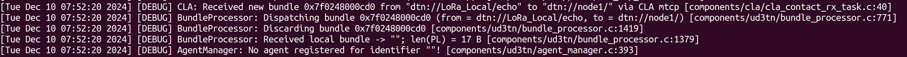
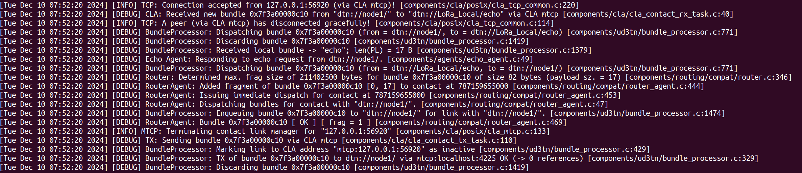

# DTN7 LoRa-DTN7 CLA Integration

Below are the screenshots illustrating the workflow of the DTN7 LoRa-DTN7 CLA integration.

## Screenshots

**Screenshot 5** - Data source: Generates data to be transmitted.

**Screenshot 6** - DTN7 Node: Bundles data using DTN protocols.

**Screenshot 7** - CLA LoRa: Encapsulates DTN bundles for LoRa transmission.

### Transmission and Reception

**Screenshot 8** - Serial print for the bundle transmission in LoRa TX.

**Screenshot 9** - Bundle reception in WebSocket RX.

**Screenshot 10** - CLA MTCP: Adapts received data for µD3TN nodes.

**Screenshot 11** - µD3TN Node: Processes bundles for end applications.
